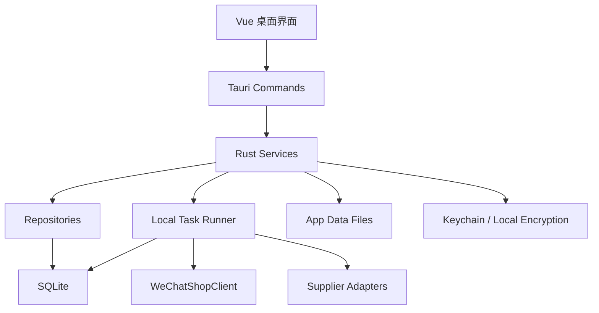

# Tauri 桌面端架构设计

## 1. 结论

项目优先采用 Tauri 桌面端，而不是独立 Web 管理后台。原因是当前使用人数只有两人，核心诉求是快速把多店铺、铺货、订单、采购、售后和动销闭环跑起来，桌面端能显著降低部署、运维和账号体系复杂度。

桌面端不是弱化版，业务能力仍按完整运营中台设计：

- 多店铺逐店 `appid/app_secret` 直连。
- 外部供应商代发。
- 三层商品模型：供应商商品 -> 标准商品 -> 店铺商品。
- 本地任务执行铺货、订单、库存、售后和动销同步。
- 本地 SQLite 持久化，支持备份和未来迁移服务端。

## 2. 技术栈

默认技术栈：

- 桌面框架：`Tauri v2`
- 前端：`Vue 3 + Vite + TypeScript + Element Plus`
- 后端命令层：Rust `tauri::command`
- 数据库：SQLite
- 后台任务：Rust `tokio` worker + SQLite 任务表
- 文件目录：Tauri app data 目录
- 密钥：系统 Keychain 优先，本地加密兜底

不默认引入：

- `FastAPI`
- `PostgreSQL`
- `Redis`
- `Celery`
- Docker 部署

这些只在明确需要多人在线协作、远程访问或服务器 24 小时无人值守时再引入。

## 3. 本地运行架构



层级职责：

- 前端只负责界面、交互、筛选、任务进度展示。
- Tauri command 只负责参数校验、权限校验、调用 service。
- Service 承载业务规则，例如铺货预览、订单生成采购单、售后责任归因。
- Repository 封装 SQLite，不让业务代码散落 SQL。
- Task runner 负责所有耗时、可重试、可暂停的操作。
- WeChatShopClient 统一封装微信小店 API。

## 4. 数据目录

建议 app data 目录结构：

```text
wx-xd/
  wx-xd.sqlite
  wx-xd.sqlite-wal
  wx-xd.sqlite-shm
  backups/
    2026-05-22_153000.zip
  imports/
    supplier-products/
  exports/
    purchase-orders/
    analytics/
  media-cache/
    wechat/
    supplier/
  logs/
    app.log
    api-calls.jsonl
    task-runs.jsonl
```

规则：

- 数据库路径必须在“系统设置 -> 数据与备份”中可见。
- 所有导入文件保留原始文件副本，方便回溯。
- 图片缓存只作为加速和追溯，不作为唯一数据源。
- 日志中禁止出现完整密钥、token、收件人完整手机号和完整地址。

## 5. SQLite 设计

SQLite 使用原则：

- 开启 WAL，提高任务写入和界面读取并发能力。
- 所有写操作走事务。
- 任务、铺货、发货、采购等关键动作必须有幂等键。
- 所有核心表保留 `created_at`、`updated_at`、`deleted_at` 或 `status`。
- 时间默认使用上海时区，字段约定必须明确是带偏移文本还是 Unix 时间戳。

本地任务相关表：

| 表 | 用途 |
| --- | --- |
| `task_runs` | 任务实例，例如铺货、订单同步、库存同步 |
| `publish_job_items` | 铺货任务项，例如某个店铺某个商品的铺货动作 |
| `publish_assets` | 铺货素材缓存，记录外部图片、微信图片链接、上传状态和失败原因 |
| `task_logs` | 任务日志，记录进度、错误、重试 |
| `external_api_logs` | 本地主控 HTTP API 请求审计日志 |
| `operation_logs` | 用户操作审计 |

任务状态：

- `pending`
- `running`
- `paused`
- `interrupted`
- `success`
- `partial_success`
- `failed`
- `cancelled`
- `ready_to_publish`：本地前置校验通过，等待素材上传、微信发品和审核。
- `category_prechecked`：微信 `categoryprecheck` 已通过，等待素材上传。
- `assets_ready`：微信图片素材已准备好，等待构造并调用 `addproduct`。
- `submitted`：微信 `addproduct` 已返回 `product_id`，等待审核状态同步。
- `audit_pending`：微信 `getproduct` 显示商品仍在审核、上传或异步提审中。
- `audit_passed`：微信审核已通过，但商品尚未确认上架。
- `listing`：正在调用微信 `listingproduct` 上架。

## 6. 本地任务机制

所有耗时动作必须变成本地任务：

- 店铺凭证验证。
- 类目和发品规则同步。
- 供应商商品导入。
- 批量铺货。
- 审核状态轮询。
- 供应商库存同步。
- 微信库存同步。
- 订单同步。
- 采购单提交。
- 微信发货。
- 售后同步。
- 动销日统计。

执行规则：

- 同一店铺的微信 API 调用串行限流，避免触发平台限制。
- 不同店铺可并发，但全局并发数要可配置。
- 应用退出时，运行中任务落库为 `interrupted` 或 `paused`。
- 下次启动时，任务中心提示可恢复、重试、取消。
- 每个任务项独立记录失败原因，批量任务不因单项失败整体回滚。

## 7. 两人协作模式

桌面端默认不是实时多人系统。两个人使用时建议三种模式：

### 单主控机模式

一台电脑作为主控机，负责店铺同步、铺货、订单、库存和售后任务。另一人通过导出的 Excel/CSV 或远程桌面协作。

优点：

- 最稳，避免 SQLite 多机冲突。
- 任务不会因为两台电脑同时操作而重复铺货或重复发货。

限制：

- 主控机要保持开机、联网、不休眠。

### 共享备份模式

两个人不同时操作同一份数据，通过备份文件传递数据。

优点：

- 不需要服务器。

限制：

- 不能并行操作。
- 恢复备份会覆盖本机当前数据，必须有确认和回滚备份。

### 后续服务端模式

当确实需要两个人实时协作，升级为服务端：

- SQLite 迁移到 PostgreSQL。
- 本地 task runner 迁移到服务端 worker。
- Tauri 继续作为桌面客户端。
- Rust service/repository 边界尽量复用。

## 8. 备份与恢复

必须实现：

- 一键备份。
- 启动前或退出前自动备份。
- 每日自动备份。
- 备份文件 sha256 校验。
- 恢复前自动备份当前数据。
- 恢复后执行数据库完整性检查。

备份内容：

- SQLite 数据库。
- 导入原始文件。
- 导出文件索引。
- 关键配置。
- 不包含明文密钥。

恢复规则：

- 恢复前展示备份时间、文件大小、校验状态、数据库版本。
- 恢复时关闭任务 runner。
- 恢复成功后重启应用或重新初始化数据库连接。

当前 MVP 已实现：

- `list_database_backups` 扫描应用数据目录下的 `backups/`，展示文件名、大小、SHA-256、创建时间和 `integrity_check` 结果。
- `create_database_backup` 在备份前执行 WAL checkpoint，再复制 SQLite 主库文件并校验备份完整性。
- `restore_database_backup` 只允许从应用备份目录恢复；恢复前自动创建 `pre-restore` 回滚备份，恢复后再次执行完整性校验。
- 当前仍未实现启动前/退出前/每日自动备份，也未纳入导入原始文件和导出文件索引。

## 9. 密钥与敏感信息

密钥：

- `app_secret`、`access_token`、供应商 API key 不允许明文入库。
- 优先把主密钥放系统 Keychain。
- SQLite 中保存密文、密钥版本和轮换时间。

敏感信息：

- 收件人姓名、手机号、地址默认脱敏展示。
- 解密必须有权限、原因和操作日志。
- 日志和错误消息中禁止输出完整敏感信息。

## 10. 什么时候不适合纯桌面端

出现以下情况时，应升级服务端：

- 需要两个人同时在线操作同一批订单和商品。
- 需要 24 小时无人值守同步订单、库存和售后。
- 需要异地访问。
- 需要多角色细粒度权限和审批。
- 数据量大到本机 SQLite 查询和备份明显变慢。
- 需要和其他系统稳定 webhook 集成。

升级时不要推翻业务模型，只迁移运行形态：

- Vue 界面可以继续复用。
- Rust service/repository 可以迁移或拆出服务。
- SQLite 表结构可迁移到 PostgreSQL。
- 本地任务表模型可迁移到服务端任务队列。
