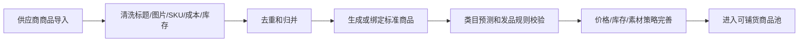
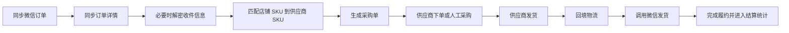
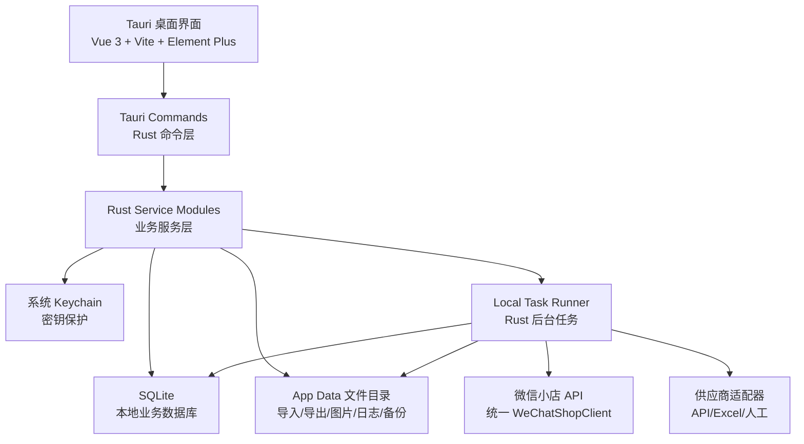

# 微信小店 Tauri 桌面运营中台系统设计

## 1. 系统定位

本系统面向微信小店多店铺运营，核心是把外部供应商商品变成可治理、可批量铺货、可履约、可分析的运营资产。系统不只是“调用微信接口”，而是围绕店铺、供应商、商品、订单、采购、售后和动销数据建立一套桌面运营中台。

业务口径：

- 产品形态：优先做 `Tauri v2` 桌面端，面向两人内部使用；默认本机运行、本地数据库、本地任务。
- 多店铺：支持 50-200 个微信小店逐店直连接入，按店铺组运营、铺货、同步和分析。
- 外部供应商代发：供应商可来自人工维护、Excel/CSV 导入、外部 API；内部用采购单串起履约。
- 动销铺货：动销指真实销售和运营表现分析，不做刷单、虚假交易或绕平台规则。
- 官方接口优先：微信侧能力以 `docs/wechat-shop-api/` 的官方文档缓存为准。

系统目标：

- 让两名内部运营能在桌面端集中管理多店铺状态、商品、铺货任务和异常。
- 让商品从供应商货源进入标准商品库，再稳定映射到各店铺商品。
- 让订单从微信同步后自动进入采购、发货、售后和结算链路。
- 让动销分析基于真实订单、库存、售后和微信罗盘数据给出经营建议。

## 2. 角色与业务边界

主要角色：

- 系统管理员：管理用户、角色、店铺密钥、系统配置和安全策略。
- 店铺运营：维护店铺组、铺货策略、上下架、商品状态和异常任务。
- 商品运营：维护供应商商品、标准商品、类目、品牌、图片、价格和规则。
- 履约人员：处理订单、采购单、供应商发货、物流回填和异常履约。
- 售后人员：处理退款、退货、纠纷、供应商责任和售后凭证。
- 经营分析人员：查看店铺、商品、供应商、铺货批次的动销和毛利表现。

明确不做：

- 不实现刷单、虚假动销、虚假物流、绕审核、绕风控、绕平台规则能力。
- 不把微信小店作为单一数据源，供应商履约和内部任务状态必须自有记录。
- 不在 UI 交互里直接阻塞执行长耗时铺货、订单同步、库存同步和数据统计；桌面端也必须通过本地任务执行。

## 3. 能力地图

### 3.1 店铺中心

能力：

- 录入逐店 `appid/app_secret`，验证 access token，拉取店铺基础信息。
- 店铺分组、标签、负责人、状态、启停、异常标记。
- 店铺接口健康度、额度、失败率、最近同步时间和任务积压监控。
- 店铺级限流、熔断、暂停同步和批量恢复。

关键接口参考：

- `apimgnt/common/api_getaccesstoken.html`
- `apimgnt/common/api_getstableaccesstoken.html`
- `apimgnt/common/api_getapiquota.html`
- `storemanage/api_mmecapi_basicinfo.html`

### 3.2 供应商中心

能力：

- 维护供应商档案、结算方式、发货时效、退货规则、售后联系人。
- 支持 Excel/CSV 导入、人工录入、外部 API 适配。
- 管理供应商商品、SKU、成本价、建议售价、库存、主图、详情图和发货地。
- 记录供应商商品上下架、价格变动、库存变动和质量异常。

设计重点：

- 供应商商品是货源，不直接等于可铺货商品。
- 供应商 SKU 必须映射到标准 SKU，再映射到店铺 SKU。
- 每个供应商适配器只负责“取商品、取库存、下采购单、查物流、同步售后”这些边界，不侵入核心业务模型。

### 3.3 商品中心

能力：

- 建立标准商品库：标题、短标题、类目、品牌、属性、图片、详情、规格、SKU。
- 类目预测、发品规则校验、品牌和资质校验。
- 图片素材统一入库，必要时上传到微信素材接口。
- 价格策略：成本价、加价率、保护价、店铺差异价、活动价、毛利预估。
- 商品质量控制：标题长度、敏感词、重复图、低清图、缺失属性、资质缺失。

关键接口参考：

- `channels-shop-category/api_getallcategory.html`
- `channels-shop-category/api_getcategorydetail.html`
- `category-rule/api_getcategoryproductrule.html`
- `brand/api_getvalidbrandlistlogic.html`
- `channels-shop-product/shop/api_product_classify.html`
- `channels-shop-product/shop/api_categoryprecheck.html`
- `apimgnt/resource/api_img_upload.html`

### 3.4 铺货中心

能力：

- 接收外部系统按本系统协议推送的商品，创建批量铺货任务并返回 `task_id`。
- 支持外部系统查询店铺组，再按店铺组发起铺货。
- 系统自动补齐微信类目、属性、发品规则、素材上传、定价、发货方式和服务配置。
- 任务项级执行：每个商品、每个店铺独立记录状态、微信 `product_id`、`sku_id`、失败原因和重试次数。
- 支持新增商品、上架、审核状态轮询和失败补偿。
- 暂不支持外部 API 更新已有商品；同一 `external_product_id` 已铺过同一店铺时，任务项报重复失败。
- 任务详情默认按商品查看失败原因，并可展开到店铺维度。
- 素材处理作为独立阶段，支持下载、301/302 跳转检查、格式检查、去重、压缩/转格式、本地缓存和上传微信素材。
- 首版采用简单定价策略，不做店铺组差异化策略。

核心状态：

- 铺货任务：`draft`、`queued`、`running`、`partial_success`、`success`、`failed`、`cancelled`。
- 铺货任务项：`pending`、`prechecking`、`asset_uploading`、`creating`、`updating`、`auditing`、`listing`、`listed`、`failed`、`skipped`。

关键接口参考：

- `channels-shop-product/shop/api_addproduct.html`
- `channels-shop-product/shop/api_updateproduct.html`
- `channels-shop-product/shop/api_getproduct.html`
- `channels-shop-product/shop/api_getproductlist.html`
- `channels-shop-product/shop/api_listingproduct.html`
- `channels-shop-product/shop/api_delistingproduct.html`
- `channels-shop-product/shop/api_getproductauditquota.html`
- `channels-shop-product/shop/api_externalproductmappingnew.html`

### 3.5 库存与价格中心

能力：

- 同步供应商库存，计算标准 SKU 可售库存，再分配到各店铺 SKU。
- 店铺库存策略：固定库存、按比例库存、安全库存、低库存下架、断货下架。
- 微信库存更新优先使用增减量语义；直接设置库存只用于人工校准或补偿。
- 价格变动进入审核或策略队列，避免供应商成本波动直接影响所有店铺售价。
- 库存流水和价格变更都要可追溯到来源、操作者、任务和店铺。

关键接口参考：

- `channels-shop-product/stock/api_getstock.html`
- `channels-shop-product/stock/api_batchgetstock.html`
- `channels-shop-product/stock/api_updatestock.html`
- `channels-shop-product/stock/api_getstockflow.html`

### 3.6 订单与履约中心

能力：

- 按店铺同步微信订单列表和订单详情。
- 解密履约必需的收件人信息，内部脱敏存储和展示。
- 自动匹配店铺 SKU -> 标准 SKU -> 供应商 SKU，生成采购单。
- 支持一个微信订单按不同供应商拆成多个采购任务。
- 首版支持导出采购表和供应商 agent 安全桥，不做自动登录供应商平台下单。
- 首版物流单号人工录入；后续可通过供应商 agent 安全桥写回已确认物流，自动登录抓取必须走独立适配器和显式开关。
- 获取物流公司和物流单号后，可按开关自动调用微信发货接口。
- 处理缺货、改址、取消、拆单、部分发货、物流异常。
- 供应商缺货时通知用户处理，不自动换供应商、不自动取消采购。
- 订单模块必须核算预估利润和实际利润。

核心状态：

- 内部订单：`synced`、`pending_purchase`、`purchasing`、`waiting_supplier_ship`、`supplier_shipped`、`wechat_shipped`、`completed`、`cancelled`、`exception`。
- 采购单：`draft`、`submitted`、`accepted`、`rejected`、`shipped`、`completed`、`cancelled`、`after_sale`。

关键接口参考：

- `channels-shop-order/api_getorderlist.html`
- `channels-shop-order/api_getorder.html`
- `channels-shop-order/api_searchorder.html`
- `channels-shop-order/api_decodesensitiveinfo.html`
- `channels-shop-delivery/delivery/api_senddelivery.html`
- `channels-shop-delivery/delivery/api_getdeliverycompanylistnew.html`

### 3.7 售后与纠纷中心

能力：

- 同步售后单、售后详情、售后原因、拒绝原因和纠纷单。
- 将售后单关联到微信订单、内部订单、采购单、供应商、物流和商品。
- 识别供应商责任、买家责任、物流责任、平台规则责任。
- 支持同意、拒绝、上传凭证、差额退款、换货、退货入库等操作策略。
- 供应商售后协同：生成供应商售后单，记录沟通、凭证、赔付和成本。

当前 MVP：

- 已落地 `run_aftersale_sync_once` 和 `list_aftersales`，按 active 店铺逐店同步售后列表和详情。
- 售后列表按官方限制单次最多取 24 小时窗口；每店最多翻 5 页，防止桌面交互长时间阻塞。
- 售后详情保存到本地 `aftersales` 前递归脱敏，禁止保存姓名、电话、地址、openid 等敏感字段。
- 处理中售后关联到本地订单后标记 `aftersale_active`；退款成功后按售后单号幂等写入订单级 `refund` 调整项。
- 支持在售后异常处理台人工记录责任方、处理备注和供应商赔付金额；已关联订单的供应商赔付会写入订单级 `other_income` 调整项。
- 支持按店铺同步微信官方售后拒绝原因，拒绝售后时优先从缓存原因中选择 `reject_reason_type` 和默认说明。
- 支持人工或受控本地主控 API 提交微信售后同意/拒绝，并在本地记录最近动作、动作状态、错误摘要、备注和动作时间。
- 支持调用微信 `searchguaranteeorder/getguaranteeorder` 同步纠纷/保障单，脱敏保存详情，并在售后异常页展示状态、赔付金额、举证过期时间和关联订单。
- 支持在售后异常处理台和本地主控 API 记录纠纷本地跟进状态、责任方、备注和供应商赔付；已关联订单的供应商赔付会写入订单级 `other_income` 调整项。
- 支持本地凭证资料包，按售后单或纠纷单记录凭证类型、标题、说明、本地文件路径和来源链接，并在列表展示每单本地凭证数量、支持按单过滤查看；只保存元数据，不读取文件内容、不上传微信。
- 支持供应商售后协同记录，按售后单或纠纷单保存脱敏沟通摘要、索证状态、供应商名称和可选采购任务引用；不登录供应商平台、不保存收件信息、不直接计入利润。
- 当前不自动上传凭证，不调用微信纠纷处理动作，售后同意/拒绝不进入自动推进 runner；平台最终状态仍以后续售后同步为准。

关键接口参考：

- `channels-shop-aftersale/aftersale/api_getaftersalelist.html`
- `channels-shop-aftersale/aftersale/api_getaftersaleorder.html`
- `channels-shop-aftersale/aftersale/api_acceptapply.html`
- `channels-shop-aftersale/aftersale/api_rejectapply.html`
- `channels-shop-aftersale/aftersale/api_getaftersalerejectreason.html`
- `channels-shop-aftersale/guarantee/api_searchguaranteeorder.html`
- `channels-shop-aftersale/guarantee/api_getguaranteeorder.html`

### 3.8 动销与经营分析中心

能力：

- 按店铺、店铺组、商品、类目、供应商、铺货批次统计真实经营表现。
- 关键指标：曝光、点击、收藏、成交件数、成交金额、退款金额、退款率、毛利、库存周转、动销天数、滞销天数。
- 运营建议：继续铺货、扩店铺组、调价、换图、补库存、下架、替换供应商。
- 异常识别：高退款、低毛利、库存同步失败、订单履约超时、售后集中、接口失败率高。
- 当前 MVP 先用本地真实订单、采购成本、售后关联、铺货覆盖和库存风险生成商品级动销建议；微信罗盘、收藏和资金流水作为后续增强数据源。

关键接口参考：

- `compass/api_getshopoverall.html`
- `compass/api_getshopproductlist.html`
- `compass/api_getshopproductdata.html`
- `compass/api_getshopsaleprofiledata.html`
- `favorite/shopfavorite/api_getfavoritescount.html`
- `funds/funds/api_listorderflow.html`

## 4. 业务主流程

### 4.1 店铺接入

失败处理：

- token 获取失败：标记店铺为 `auth_failed`，不进入同步任务。
- 基础信息拉取失败：保留密钥校验结果，允许稍后重试。
- 权限不足：记录具体接口和错误码，店铺能力降级，不影响其他店铺。

### 4.2 货源入库到标准商品

关键规则：

- 导入数据保留原始字段，标准商品保存清洗后的业务字段。
- 供应商商品变化不直接覆盖标准商品，必须经过同步策略或人工确认。
- 标准商品缺类目、缺规格、缺图片、缺成本、缺库存时不能直接铺货。

### 4.3 批量铺货

关键规则：

- 任务按店铺隔离执行，单店失败不阻塞其他店铺。
- 每个任务项必须可重试、可跳过、可查看微信原始错误摘要。
- 发现重复铺货时优先绑定已有店铺商品，而不是重复创建。
- 商品审核失败要沉淀为规则，用于下次铺货前预警。

### 4.4 订单到采购履约

关键规则：

- 微信订单和内部订单分开建模，内部订单承载采购、异常和利润。
- 收件人信息只在履约需要时解密，展示和日志必须脱敏。
- 采购失败、缺货、供应商拒单、物流异常要进入异常队列。
- 发货成功后同步更新店铺订单、采购单、物流单和经营指标。

当前落地边界：

- `run_order_sync_once` 只同步微信待发货订单列表，不落收件人敏感信息。
- `run_order_detail_sync_once` 调用微信 `getorder` 补订单详情和订单项，订单详情按白名单脱敏保存。
- `run_purchase_task_generation_once` 从订单项生成采购任务，同时具备外部商品 ID 和外部 SKU 才进入 `pending_purchase`，缺任一映射进入 `needs_mapping`；货源链接优先从店铺商品映射带出，缺失时回退到外部铺货商品记录。
- `resolve_purchase_task_mapping` 由人工或受控本地 API 补齐外部商品/外部 SKU 和可选货源链接，同时更新订单项映射并清除缺映射通知。
- `mark_purchase_task_issue` 可将采购任务标记为供应商缺货、涨价、取消、质量风险或其他异常，并进入通知中心等待人工处理。
- 首版采购和物流单号仍以人工处理为主；微信自动发货必须受开关控制，供应商自动下单 agent/skill 暂不实现。

### 4.5 售后与供应商追责

关键规则：

- 售后处理不能只看微信状态，必须追踪供应商责任和成本影响。
- 高退款商品、高退款供应商、高纠纷店铺进入动销分析和风控提醒。

## 5. 技术架构

### 5.1 总体架构

默认技术栈：

- 前端：`Vue 3`、`Vite`、`TypeScript`、`Element Plus`。
- 桌面壳：`Tauri v2`。
- 后端能力：`Rust` command 层、service 层、repository 层。
- 数据库：`SQLite`，通过迁移管理 schema 版本。
- 异步任务：本地 `task_runs` / `task_items` 表 + Rust 后台 worker。
- 文件：Tauri app data 目录，保存导入文件、导出文件、图片缓存、日志和备份。
- 密钥：优先使用系统 Keychain；无法使用时再落本地加密存储。

架构原则：

- 先做 Tauri 桌面模块化单体，不先建设独立服务端。
- 所有外部平台调用必须通过 Rust 适配层，前端不得直接调用微信或供应商 API。
- 所有批量、长耗时、可重试动作必须本地任务化。
- 所有任务必须可观测：进度、日志、失败原因、重试、操作者、关联业务对象。
- 如果后续需要多人实时协作或 24 小时无人值守，再把 service/repository/task 模块迁移到服务端。

### 5.2 Rust 模块边界

- `commands`：Tauri 命令入口，只做参数校验、权限校验和 service 调用。
- `identity`：本机用户、简单角色、操作审计。
- `shops`：店铺、店铺组、密钥、access token、店铺健康度。
- `wechat`：微信小店统一 client、错误码、限流、重试、接口日志。
- `suppliers`：供应商、供应商商品、供应商 SKU、供应商适配器。
- `catalog`：标准商品、标准 SKU、类目、品牌、素材、价格策略。
- `publishing`：铺货任务、任务项、微信商品映射、审核轮询、上下架。
- `attribute-fill`：基于类目详情缓存、外部 AI 建议和安全规则补齐微信必填属性。
- `inventory`：库存快照、库存策略、库存同步任务、库存流水。
- `orders`：微信订单、内部订单、订单项、敏感信息访问。
- `procurement`：采购单、供应商下单、物流回填、履约异常。
- `aftersales`：售后单、纠纷单、供应商售后、赔付和凭证。
- `analytics`：动销指标、毛利、报表、建议和异常提醒。
- `notifications`：铺货、采购、履约、订单同步和售后异常的统一人工处理队列。
- `tasks`：本地任务定义、调度、任务实例、进度、失败补偿。
- `storage`：SQLite 连接、迁移、事务、备份和恢复。
- `files`：导入、导出、图片缓存、日志文件和备份文件。

### 5.3 桌面端信息架构

主导航：

- 总览：待处理订单、异常店铺、任务积压、铺货失败、主控机状态、最近同步结果。
- 通知中心：未读通知、严重异常、来源模块、店铺、摘要、定位和已读处理。
- 店铺：店铺列表、店铺组、密钥状态、接口健康、同步配置。
- 供应商：供应商档案、商品导入、供应商商品、供应商库存。
- 商品：标准商品库、类目属性、素材、价格策略、质量检查。
- 铺货：铺货任务、任务详情、店铺商品、审核失败、上下架。
- 库存价格：库存同步、低库存、断货、价格变更、库存流水。
- 订单：订单列表、订单详情、异常订单、敏感信息访问记录。
- 采购：采购单、供应商下单、物流回填、履约异常。
- 售后：售后单、纠纷单、供应商售后、赔付成本。
- 动销：店铺分析、商品分析、供应商分析、铺货批次分析。
- 系统：本机配置、用户权限、任务中心、接口日志、操作日志、数据备份、系统配置。

界面原则：

- 桌面端以表格、筛选、批量操作、状态标签和任务进度为主。
- 每个批量动作先预览影响范围，再进入后台任务。
- 任务详情必须能看到成功项、失败项、跳过项和下一步处理建议。
- 与资金、密钥、敏感信息相关的操作必须有权限和审计。

## 6. 数据模型草案

核心表：

| 表 | 作用 | 关键字段 |
| --- | --- | --- |
| `users` | 系统用户 | `id`, `name`, `email`, `status` |
| `roles` | 角色 | `id`, `name`, `permissions` |
| `shops` | 微信小店 | `id`, `name`, `appid`, `status`, `group_id`, `last_sync_at` |
| `shop_credentials` | 店铺密钥 | `shop_id`, `encrypted_secret`, `version`, `rotated_at` |
| `shop_tokens` | token 缓存 | `shop_id`, `access_token_cipher`, `expires_at`, `refresh_status` |
| `suppliers` | 供应商 | `id`, `name`, `type`, `settlement_rule`, `status` |
| `supplier_products` | 供应商商品 | `id`, `supplier_id`, `external_product_id`, `raw_payload`, `status` |
| `supplier_skus` | 供应商 SKU | `id`, `supplier_product_id`, `external_sku_id`, `cost_price`, `stock_qty` |
| `standard_products` | 标准商品 | `id`, `title`, `category_id`, `brand_id`, `quality_status`, `status` |
| `standard_skus` | 标准 SKU | `id`, `standard_product_id`, `sku_attrs`, `base_price`, `status` |
| `product_supplier_links` | 标准 SKU 与供应商 SKU 映射 | `standard_sku_id`, `supplier_sku_id`, `priority`, `status` |
| `shop_products` | 店铺商品 | `id`, `shop_id`, `standard_product_id`, `external_product_id`, `source_url`, `wechat_product_id`, `publish_status` |
| `shop_skus` | 店铺 SKU | `id`, `shop_product_id`, `standard_sku_id`, `wechat_sku_id`, `stock_strategy` |
| `publish_jobs` | 铺货任务 | `id`, `name`, `status`, `created_by`, `created_at` |
| `publish_job_items` | 铺货任务项 | `job_id`, `shop_id`, `standard_product_id`, `status`, `error_summary` |
| `publish_attribute_suggestions` | 发品必填属性建议 | `item_id`, `attr_kind`, `attr_key`, `suggested_value`, `sku_values_json`, `confidence`, `source`, `applied`, `prompt_json` |
| `wechat_orders` | 微信订单原始映射 | `shop_id`, `wechat_order_id`, `raw_payload`, `synced_at` |
| `orders` | 内部订单 | `id`, `shop_id`, `wechat_order_id`, `status`, `buyer_masked`, `paid_at` |
| `order_items` | 内部订单项 | `order_id`, `shop_sku_id`, `qty`, `sale_price`, `cost_price` |
| `purchase_orders` | 采购单 | `id`, `order_id`, `supplier_id`, `status`, `submitted_at` |
| `shipments` | 物流单 | `id`, `purchase_order_id`, `carrier_code`, `tracking_no`, `wechat_ship_status` |
| `notifications` | 人工处理通知 | `id`, `severity`, `source_type`, `source_id`, `shop_id`, `title`, `body`, `status`, `dedupe_key` |
| `order_profit_adjustments` | 订单利润调整项 | `order_id`, `kind`, `amount_cents`, `note`, `created_at` |
| `aftersales` | 售后单 | `id`, `shop_id`, `order_id`, `wechat_aftersale_id`, `status`, `responsibility` |
| `guarantee_orders` | 纠纷/保障单 | `id`, `shop_id`, `guarantee_order_id`, `wechat_order_id`, `status`, `pay_amount_cents` |
| `inventory_snapshots` | 库存快照 | `sku_type`, `sku_id`, `stock_qty`, `source`, `captured_at` |
| `metrics_daily` | 日统计 | `biz_date`, `shop_id`, `product_id`, `sales_qty`, `gmv`, `refund_amount`, `gross_profit` |
| `external_api_logs` | 本地主控 HTTP API 请求审计 | `method`, `path`, `status_code`, `error_code`, `request_summary`, `response_summary`, `duration_ms` |
| `ai_provider_credentials` | AI provider 密钥 | `id`, `encrypted_api_key`, `api_key_nonce`, `key_version`, `api_key_fingerprint`, `updated_at` |
| `task_runs` | 任务实例 | `id`, `task_type`, `status`, `progress`, `started_at`, `finished_at` |
| `task_items` | 任务项 | `task_run_id`, `resource_type`, `resource_id`, `status`, `error_summary`, `retry_count` |
| `operation_logs` | 操作日志 | `actor_id`, `action`, `resource_type`, `resource_id`, `created_at` |
| `app_settings` | 本机配置 | `key`, `value_json`, `updated_at` |
| `backup_records` | 备份记录 | `id`, `file_path`, `db_sha256`, `created_at`, `verified_at` |

时间字段：

- 业务查询和展示默认 `Asia/Shanghai`。
- SQLite 存储使用带 `+08:00` 偏移的文本时间或 Unix 时间戳，并在字段约定里固定含义；不能混用 UTC 文本当业务时间。
- 同时保留微信原始 Unix 秒级时间戳字段，方便排查官方接口数据。
- 日统计 `biz_date` 按上海自然日计算。

## 7. Tauri 命令设计草案

Tauri 命令按资源建模，前端只调用命令，不直接操作数据库或外部 API：

- `create_shop`：新增店铺。
- `verify_shop_credentials`：验证店铺凭证并同步基础信息。
- `get_shop_health`：查看店铺接口健康度。
- `import_supplier_products`：导入供应商商品文件。
- `create_standard_product`：创建标准商品。
- `list_shop_groups`：查询店铺组，供外部系统选择目标店铺组。
- `create_external_publish_job`：外部系统按本系统协议创建铺货任务，返回 `task_id`。
- `create_price_update_job`：外部系统或人工按本系统协议创建批量改价任务，返回 `task_id`。
- `get_price_update_job`：查看改价任务详情、目标价和店铺维度失败原因。
- `get_automation_settings`：读取任务中心自动推进开关。
- `set_automation_settings`：保存自动推进步骤开关。
- `run_operational_automation_once`：串联执行一轮订单同步、订单详情、售后同步、采购任务、发货提交、铺货状态同步、商品上架和改价确认；单步失败只写入步骤错误并继续。
- `get_ai_provider_settings`：读取 AI provider 开关、Pi provider id、Custom API、base URL、模型、temperature 和密钥摘要。
- `save_ai_provider_settings`：保存 Pi provider 或 Custom provider 配置，API Key 按 provider 加密入库，默认关闭。
- `test_ai_provider`：用当前配置执行一次 JSON 连通性测试，不记录 API Key 或完整响应。
- `list_database_backups`：查看本地 `backups/` 下的数据库备份、大小、SHA-256 和完整性校验结果。
- `create_database_backup`：执行 WAL checkpoint 后创建 SQLite 备份并校验。
- `run_startup_database_backup`：应用启动后按上海日期每天最多创建一次 `auto` 前缀备份，失败不阻断启动。
- `restore_database_backup`：从应用备份目录恢复数据库，恢复前自动创建 `pre-restore` 回滚备份，恢复后执行完整性校验。
- `run_price_update_precheck_once`：执行改价前置校验，最多推进到 `ready_to_update`。
- `run_price_update_submit_once`：执行一批微信 `updateproduct` 改价提交，提交成功进入 `submitted` 等待后续同步确认。
- `run_price_update_confirm_once`：执行一批微信 `getproduct(data_type=3)` 价格确认，只有线上 `product.skus[].sale_price` 全部匹配目标价才进入 `success`。
- `preview_publish_job`：生成铺货预览。
- `create_publish_job`：创建铺货任务。
- `get_publish_job`：查看任务详情和任务项。
- `list_task_runs`：查看本地任务中心任务列表、进度和任务项统计。
- `run_publish_tasks_once`：执行一批铺货任务项的本地前置校验，最多推进到 `ready_to_publish`。
- `run_publish_attribute_fill_once`：处理 `CATEGORY_ATTRS_NEED_AI_FILL` 失败项，按外部 AI 建议、类目单选项、SKU 规格同义词和明确标题规则生成补齐建议；高置信补齐后回到 `ready_to_publish`。
- `run_publish_ai_attribute_suggestions_once`：启用 AI provider 后读取 `publish_attribute_suggestions.prompt_json` 输入，生成属性候选值并复用本地高置信应用规则。
- `list_publish_attribute_suggestions`：查看待确认/已采纳属性建议，展示建议值、SKU 级映射、允许值、来源和置信度。
- `list_publish_attribute_suggestions` 支持按 `job_id`、`item_id` 过滤，用于铺货任务详情内定位当前商品/店铺的建议。
- `apply_publish_attribute_suggestions`：人工采纳一组属性建议，写回发品草稿后重新校验缺失属性，只能回到 `ready_to_publish` 或继续保持待补齐状态。
- `run_publish_category_prechecks_once`：执行一批微信 `categoryprecheck` 发品前预检，结合本地类目详情缓存检查必填属性，通过后进入 `category_prechecked`。
- `run_publish_asset_uploads_once`：执行一批微信图片素材上传，最多推进到 `assets_ready`。
- `run_publish_submits_once`：执行一批微信 `addproduct` 提交，成功后保存 `product_id` 并进入 `submitted`。
- `run_publish_status_sync_once`：执行一批微信 `getproduct` 审核/商品状态同步，推进到 `audit_pending`、`audit_passed`、`success` 或 `failed`。
- `run_publish_listing_once`：执行一批微信 `listingproduct` 上架，只处理 `audit_passed`，上架请求成功后回到 `audit_pending` 等待最终确认。
- `run_operational_automation_once`：按开关串联订单、采购、发货、铺货发布全链路和改价确认；铺货顺序固定为本地校验 -> 必填属性补齐 -> 类目预检 -> 素材上传 -> `addproduct` -> 状态同步 -> 上架。
- `delisting_shop_product`：下架。
- `create_inventory_sync_job`：创建库存同步任务。
- `run_order_sync_once`：同步一批 active 店铺的微信待发货订单列表，写入本地 `orders` 和任务日志。
- `run_order_detail_sync_once`：同步一批订单详情和订单项，白名单脱敏保存微信订单详情。
- `run_aftersale_sync_once`：同步一批 active 店铺的售后列表和详情，脱敏保存，失败单保留原因。
- `list_aftersales`：按处理中、同步失败、退款成功等状态查看售后异常、关联订单和人工责任归因。
- `list_aftersale_reject_reasons`：查询按店铺缓存的微信官方售后拒绝原因，可按适用场景过滤。
- `sync_aftersale_reject_reasons`：按店铺调用微信 `rejectreason/get` 同步拒绝原因字典。
- `record_aftersale_responsibility`：记录售后责任方、处理备注和供应商赔付；有本地订单关联时同步写入利润回款。
- `list_aftersale_evidence` / `record_aftersale_evidence` / `update_aftersale_evidence_status` / `export_aftersale_evidence`：查询、记录、更新和导出售后/纠纷本地凭证资料元数据，售后/纠纷列表按本地元数据展示凭证数量，不读取文件内容、不上传微信。
- `list_supplier_aftersale_followups` / `record_supplier_aftersale_followup`：查询和记录售后/纠纷供应商协同摘要，只保存脱敏沟通进度、索证状态、供应商名称和采购任务引用，不调用供应商平台或微信处理接口。
- `accept_aftersale`：人工或受控 API 提交微信售后同意，记录 API 调用结果和最近动作，不直接改平台最终状态。
- `reject_aftersale`：人工或受控 API 提交微信售后拒绝，记录 API 调用结果和最近动作，不进入自动推进。
- `list_guarantee_orders`：查看已同步纠纷/保障单、举证状态、赔付金额、过期时间和关联订单。
- `record_guarantee_followup`：记录纠纷本地跟进状态、责任方、处理备注和供应商赔付；有本地订单关联时同步写入利润回款。
- `run_guarantee_sync_once`：按店铺调用微信 `searchguaranteeorder/getguaranteeorder` 同步一批纠纷/保障单，脱敏保存并写入通知中心。
- `run_purchase_task_generation_once`：从订单项生成采购任务，有映射进入待采购，缺映射进入待人工处理。
- `list_purchase_tasks`：按状态查看采购任务、外部商品映射、商品数量、金额和处理原因，不返回收件人敏感信息。
- `resolve_purchase_task_mapping`：补齐待映射采购任务的外部商品 ID/外部 SKU、可选货源链接和可选供应商字段，任务回到待采购。
- `export_purchase_tasks`：导出非敏字段采购表 CSV，供人工采购处理。
- `mark_purchase_task_issue`：人工标记供应商缺货、涨价、取消、质量风险或其他异常，订单进入异常待处理，不自动换供应商或取消订单。
- `record_purchase_task_shipment`：按采购任务回填供应商物流和采购成本；整单采购物流齐备且一致时自动生成订单级发货单。
- `list_order_profit_summaries`：按订单汇总成交额、采购成本、采购运费、退款、售后赔付、供应商赔付回款、其他成本和预估/实际毛利。
- `record_order_profit_adjustment`：记录订单级利润调整项，支持采购运费、退款、售后赔付、其他成本和其他收入。
- `list_inventory_risks`：基于外部商品库存、采购占用、供应商异常和已铺店铺数生成库存风险视图。
- `run_inventory_risk_scan_once`：创建 `inventory.scan_risks` 任务，扫描断货、低库存、库存压力和供应商异常并写入通知。
- `list_product_sales_analysis`：按外部商品 ID 聚合真实订单、采购成本、售后关联、铺货覆盖和库存风险，输出商品级运营建议。
- `get_delivery_settings`：读取履约发货配置。
- `list_delivery_companies`：查询本地缓存的微信快递公司编码，供物流回填表单使用。
- `sync_delivery_companies`：按店铺调用微信 `getdeliverycompanylistnew` 同步快递公司列表并写入缓存。
- `set_auto_send_delivery`：设置自动微信发货开关；开启时将待确认物流推进到待提交发货。
- `record_order_shipment`：人工回填物流单号，自动发货关闭时只进入待确认状态。
- `list_delivery_shipments`：查看发货队列、物流状态和失败原因。
- `retry_delivery_shipment`：将失败或待处理物流单重新放回待确认/待提交状态。
- `run_delivery_submission_once`：执行一批微信 `senddelivery` 发货，成功后推进订单和物流状态。
- `get_product_analytics`：后续接入微信罗盘后的商品动销增强分析。
- `get_shop_analytics`：店铺经营分析。
- `list_external_api_logs`：查看外部接口调用日志。
- `create_backup`：创建本地备份。
- `restore_backup`：恢复本地备份。

命令规则：

- 创建批量任务只返回任务 ID，不等待任务完成。
- 查询接口统一支持店铺、店铺组、状态、时间范围和分页。
- 敏感字段默认脱敏；明文访问必须独立接口、权限校验和审计。
- 命令返回结构化错误码，前端按错误码展示可操作的错误说明。

## 7.1 本地主控 HTTP API（已移除）

本机 HTTP API（原 `127.0.0.1:17890`，含外部发品/改价/采购/售后等全部 HTTP 端点、API Key 鉴权与调用审计）已于铺货重构中整体移除：实际运行期间没有任何外部消费方，维护成本与安全面收益不成比例。全部能力收敛为桌面端 Tauri 命令；采集链路经内部函数 `create_external_publish_job` 创建铺货任务。如未来需要重新对外暴露接口，须按当时需求重新设计鉴权与审计，不应直接还原旧实现。

## 8. 任务与调度设计

任务类型：

- `shop.verify`：店铺凭证验证。
- `shop.sync_basic_info`：店铺基础信息同步。
- `catalog.sync_category_rules`：类目和发品规则同步。
- `supplier.import_products`：供应商商品导入。
- `publish.create_external_job`：接收外部铺货请求并创建任务。
- `publish.ai_attribute_suggestions`：对缺失类目属性生成 AI 候选建议。
- `publish.execute_job`：铺货任务执行。
- `publish.poll_audit_status`：商品审核状态轮询。
- `inventory.sync_supplier_stock`：供应商库存同步。
- `inventory.sync_wechat_stock`：微信库存同步。
- `orders.sync_shop_orders`：店铺订单同步。
- `orders.sync_order_details`：订单详情和订单项同步。
- `procurement.create_purchase_tasks`：订单项生成采购任务。
- `procurement.export_purchase_orders`：导出采购表。
- `procurement.submit_purchase_order`：采购单提交。
- `delivery.submit_wechat_shipment`：微信发货。
- `aftersales.sync_shop_aftersales`：售后同步。
- `aftersales.sync_guarantee_orders`：纠纷/保障单同步。
- `analytics.build_daily_metrics`：日统计构建。

调度规则：

- 每个任务必须有幂等键，避免重复创建造成重复铺货、重复发货或重复采购。
- 店铺级任务要受店铺限流控制；某个店铺失败不影响其他店铺。
- 批量任务按任务项推进，任务项失败后进入可重试或需人工处理状态。
- 任务日志必须能从业务对象反查，也能从任务中心反查业务对象。
- 桌面端关闭时，运行中任务要安全落库为 `paused` 或 `interrupted`；下次启动后允许继续、重试或取消。
- 如果需要稳定自动同步，应指定一台常开电脑作为主控机运行桌面端。

## 9. 安全与权限

权限模型：

- 店铺维度权限：用户只能查看和操作授权店铺或店铺组；桌面端可先实现简单本机账号和角色。
- 功能权限：店铺、商品、铺货、订单、采购、售后、财务、系统配置分开控制。
- 数据权限：成本价、毛利、收件人明文、密钥、资金流水为敏感数据。
- 操作审计：密钥查看/更新、敏感信息解密、批量铺货、批量下架、发货、售后处理必须记录。

密钥和敏感信息：

- `app_secret`、`access_token`、供应商 API key、AI provider API Key 必须加密存储。
- Tauri 桌面端优先使用系统 Keychain 保存主密钥；SQLite 中只保存密文或密钥引用。
- AI provider 默认关闭，只允许桌面端显式选择 Pi provider 或 Custom provider 后启用；Custom provider 需填写 `base_url/model/API Key`（本地无鉴权网关可留空 Key），日志、外部 API 审计和错误响应不得输出 API Key、完整 prompt 或完整模型响应。
- 收件人信息只在履约时解密，解密记录必须包含操作者、原因、订单和时间。
- 日志和错误响应中禁止出现密钥、token、收件人完整手机号、完整地址。

## 10. 观测与运营保障

看板指标：

- 店铺健康：token 状态、接口失败率、任务积压、最近成功同步时间。
- 铺货健康：任务成功率、审核失败率、重复铺货数、失败原因排行。
- 履约健康：待采购、待供应商发货、待微信发货、超时订单、异常订单。
- 售后健康：退款率、纠纷率、高风险商品、高风险供应商。
- 动销健康：成交商品数、滞销商品数、毛利、库存周转、低库存和断货。

告警规则：

- 店铺 token 连续刷新失败。
- 微信接口失败率持续超过阈值。
- 铺货审核失败集中出现同一原因。
- 订单超过承诺时效未采购或未发货。
- 供应商库存批量归零或成本大幅上涨。
- 售后率、退款率、纠纷率超过阈值。

桌面端保障：

- 启动页展示数据库路径、最近备份时间、任务恢复状态和当前主控机状态。
- 退出应用前提示仍在运行的任务，并允许后台任务安全暂停。
- 自动备份失败、连续同步失败、数据库校验失败必须在桌面端明显提示。

## 11. 落地顺序建议

不把系统能力拆成弱化版本，但工程上建议按闭环优先：

- 先创建 Tauri v2 桌面骨架、SQLite 迁移、数据目录、备份恢复和本地任务中心。
- 再形成店铺接入、官方 API client、接口日志和简单权限基础。
- 再形成供应商商品、标准商品、店铺商品的三层商品主数据。
- 接着跑通铺货、库存、订单、采购、物流回填和售后主链路。
- 最后持续增强动销分析、价格策略、供应商适配器、异常告警和运营建议。

每一步都必须保持同一套目标架构，避免先写一次性脚本再推倒重来。需要升级为 Web/服务端时，优先迁移 Rust service/repository/task 边界，而不是重写业务逻辑。
